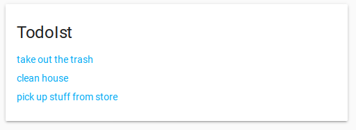

# TodoIst home assistan lovelace card

This is a custom lovelace card for displaying a todoist calendar in Home Assistant.

## Installation
1. first setup the [todoist calendar integration](https://www.home-assistant.io/integrations/todoist/)
2. Download `todoist-task-list.js` to the `www` folder.
3. reference the js file in ui-lovelace.yaml:
``` yaml
resources:
  - url: /local/todoist-task-list.js
    type: js
```
4. add the custom card configuration to ui-lovelace.yaml
``` yaml
cards:
  - type: "custom:todoist-task-list"
    entity: calendar.inbox
    title: TodoIst inbox
```

## Example
